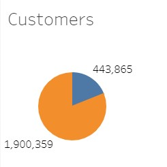
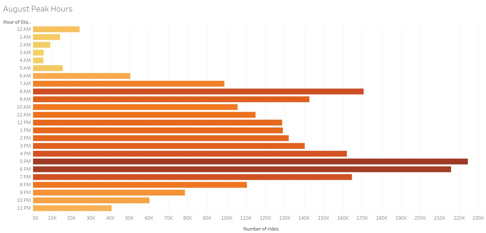
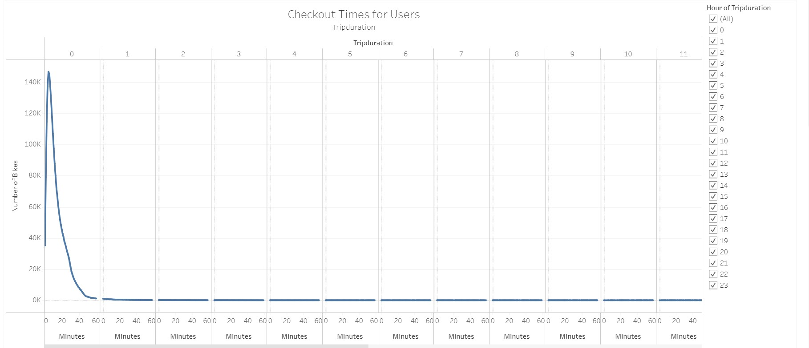
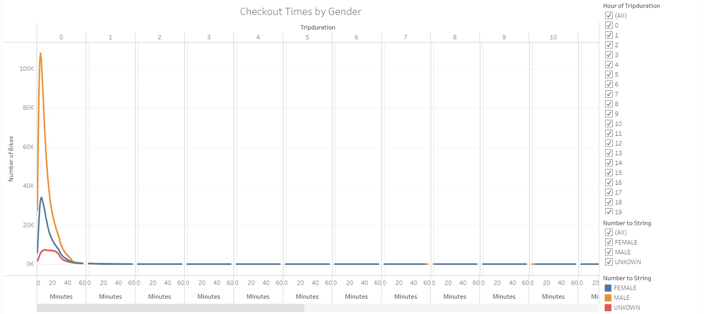
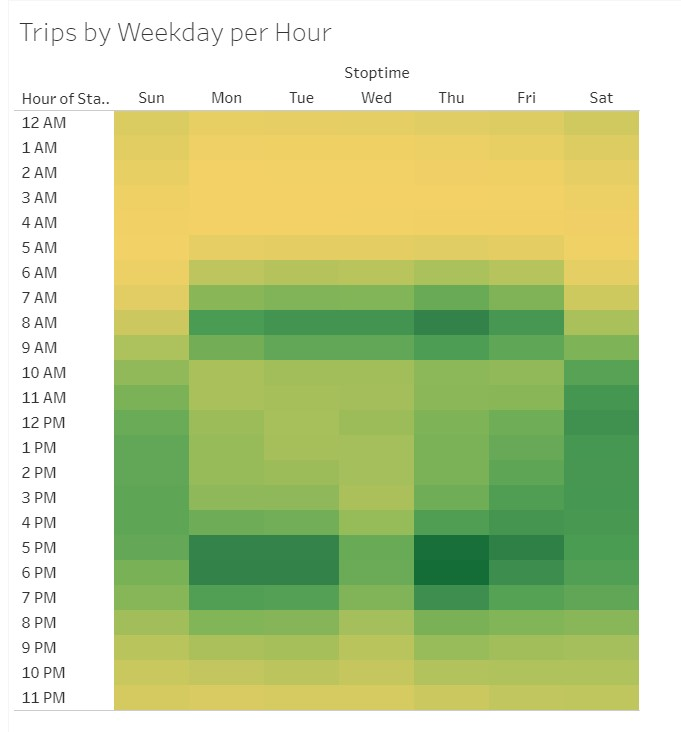
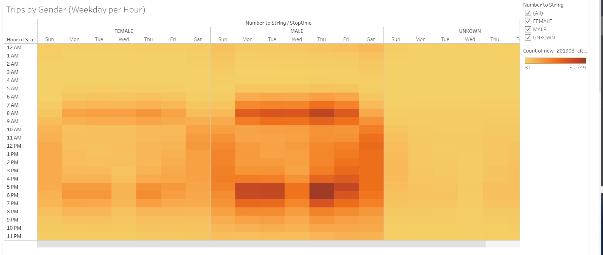
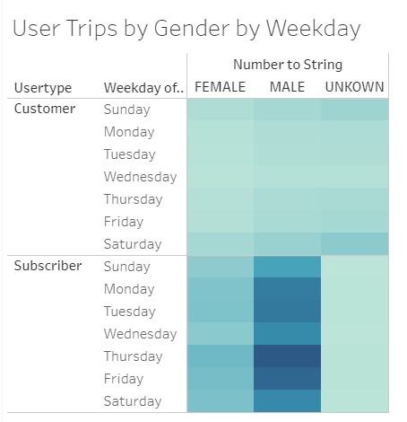

# bikesharing

## Overview of the Analysis
>The purpose of this analysis was to pull data from a New York City bike sharing company and present a summary using Tableau to convince investors that a bike-sharing program in Des Moines is a solid business proposal.

>For this analysis I created a set of visualizations to:
>1. Show the length of time that bikes are checked out for all riders and genders
>2. Show the number of bike trips for all riders and genders for each hour of each day of the week
>3. Show the number of bike trips for each type of user and gender for each day of the week.
>4. Show the number of rides per user type.
>5. Show the peak times of the day for bike usage.

## Results
### All data shown in the graphs below are from August 2019 usage data.

>The chart above shows the breakdown of the 2 user types: Customer(non-subscriber) and Subscriber(annual subscription user)

>The graph above shows the usage in number of rides for each given hour during the day.

>The graph above represents the amount of time checked out per each ride.

>The graph above reveals the amount of time checked out per each ride broken down by gender.

>The heatmap above indicates the times of day by weekday that each trip was taken. The greener the block, the higher number of rides.

>The heatmap above is similar to the previous one, except it is filterable by gender of the rider. The more orange the block, the higher number of rides that hour/day.

>This final heatmap reports the number of riders per day of the week broken down by both customer typer and gender. The deeper the blue, the higher the number of rides.

## Summary
### The link below will take you to the various analysis graphs that were created and the final Storyboard.
[link to dashboard](https://public.tableau.com/profile/jeff3975#!/vizhome/JSischo_CitiBike_Challenge/CheckoutTimesforUsers "link to dashboard")

When looking at the data from the NYC bikesharing data, we can get a high level sense of what type of user we can target in Des Moines. Some of the compelling data gives us the following conclusions and possible assumptions:
- The breakdown of user type is overwhelmingly in favor of the subscriber, about 81%. This would seem to indicate that the majority of the users are not tourists and most likely residents of NYC.
- The peak hours of usage are 5-7 PM and 8 AM. Again indicating that maybe the main user is someone who works in the area of the bike rental as those are typical work day commutes. This is further reinforced by the graph that represents the various length of times that each ride took. The overwhelming majority of rides were between 1 and 24 minutes. Most likely a short commute to work and back. 
- 
